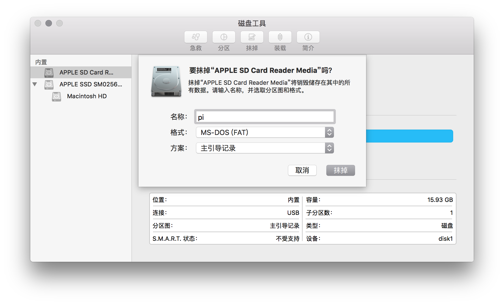
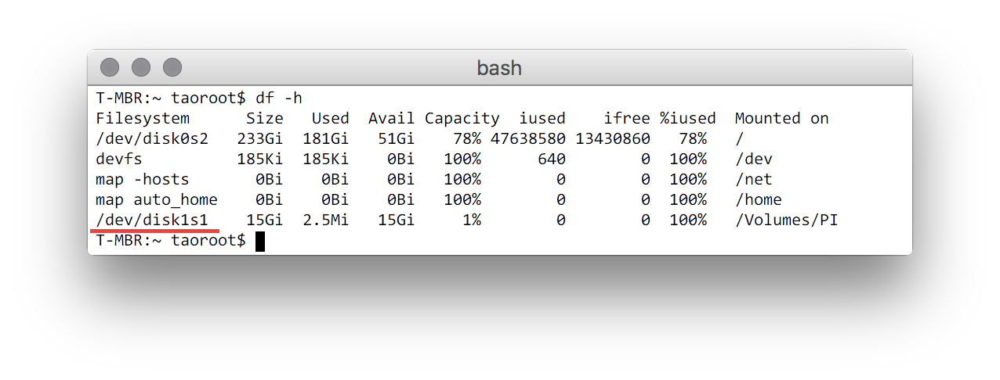
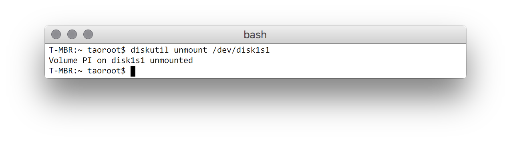
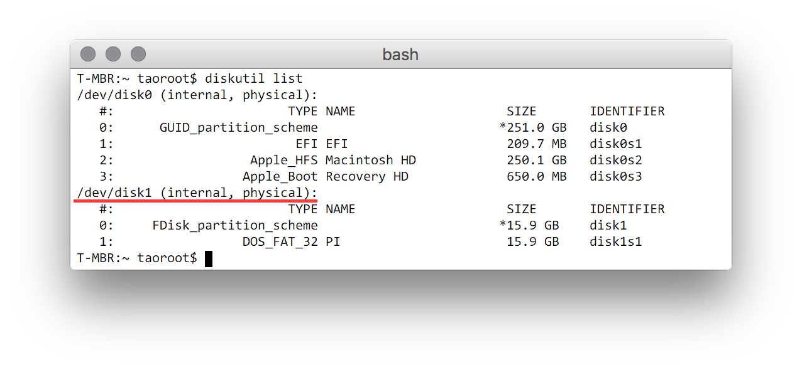

## 利用Mac安装树莓派Raspbian

### 官网下载镜像

### 格式化SD卡

使用 Mac 自带的磁盘工具，左侧选中对应的 SD 卡，点击右侧的“抹掉”标签.
格式选择:MS-DOS(FAT),名称随意

### 命令行查看挂载的卷

    df -h
    
### 卸载分区

    diskutil unmount /dev/disk1s1
   

### 确认SD卡的设备标识

    diskutil list
    

### 将Raspbian镜像写入 SD 卡

    sudo dd bs=4m if=2017-03-02-raspbian-jessie.img of=/dev/disk3

of 后面的参数则是写入设备的标识
if 后面的参数标识镜像文件路径

### 卸载设备

    diskutil unmountDisk /dev/disk3

### 开启SSH服务

新版系统中,默认不开启SSH,需要在BOOT分区(FAT)的根目录下新建一个ssh文件

    cd /boot && touch ssh
